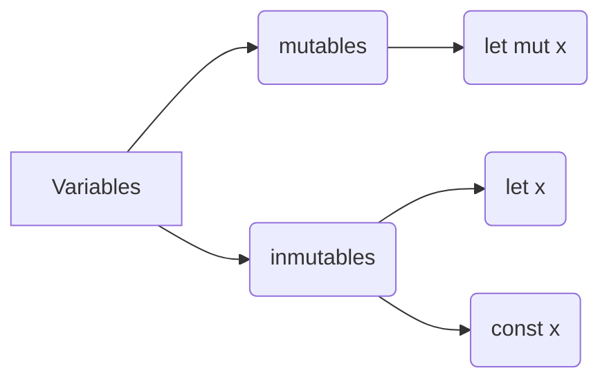

## Tipos de Variables en Rust

A continuación, se presenta una tabla que categoriza los tipos de datos en Rust, con ejemplos:

| Categoría               | Tipo de Dato                            | Descripción                                                                       | Ejemplo                                           |
|-------------------------|-----------------------------------------|-----------------------------------------------------------------------------------|---------------------------------------------------|
| **Números Enteros**     | `u8`, `u16`, `u32`, `u64`, `u128`       | Enteros sin signo de 8, 16, 32, 64 y 128 bits.                                    | `let num: u32 = 100;`                             |
|                         | `i8`, `i16`, `i32`, `i64`, `i128`       | Enteros con signo de 8, 16, 32, 64 y 128 bits.                                    | `let num: i32 = -100;`                            |
| **Números de Punto Flotante** | `f32`, `f64`                          | Números de punto flotante de 32 y 64 bits.                                        | `let floating_point: f64 = 0.123;`                |
| **Texto**               | `String`, `&str`                        | Cadenas de texto propiedad y referencias a cadenas, respectivamente.              | `let text: String = "Hello".to_string();`         |
|                         |                                         |                                                                                   | `let text: &str = "World";`                       |
| **Booleanos**           | `bool`                                  | Valores booleanos `true` o `false`.                                               | `let is_true: bool = true;`                       |
| **Compuestos**          | Tuplas                                  | Agrupa valores de diferentes tipos juntos.                                        | `let tuple: (i32, f64, u8) = (500, 6.4, 1);`      |
|                         | Arrays                                  | Colección de valores del mismo tipo.                                              | `let arr: [i32; 5] = [1, 2, 3, 4, 5];`             |
|                         | Structs                                 | Define una estructura con campos nombrados.                                       | `struct Person { name: String, age: u8 }`         |
|                         | Enums                                   | Define un tipo por enumeración con variantes.                                     | `enum Direction { Up, Down, Left, Right }`        |
