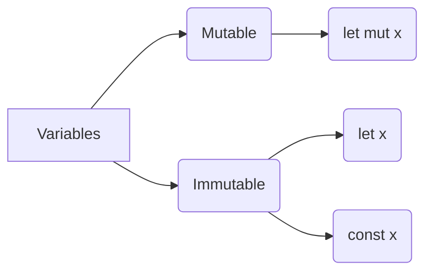

## Types of Variables in Rust

Below is a table categorizing data types in Rust, with examples:

| Category                      | Data Type                                | Description                                                                      | Example                                          |
|-------------------------------|------------------------------------------|----------------------------------------------------------------------------------|--------------------------------------------------|
| **Integer Numbers**           | `u8`, `u16`, `u32`, `u64`, `u128`        | Unsigned integers of 8, 16, 32, 64, and 128 bits.                                | `let num: u32 = 100;`                            |
|                               | `i8`, `i16`, `i32`, `i64`, `i128`        | Signed integers of 8, 16, 32, 64, and 128 bits.                                  | `let num: i32 = -100;`                           |
| **Floating-Point Numbers**    | `f32`, `f64`                             | Floating-point numbers of 32 and 64 bits.                                        | `let floating_point: f64 = 0.123;`               |
| **Text**                      | `String`, `&str`                         | Owned strings and string slices, respectively.                                   | `let text: String = "Hello".to_string();`        |
|                               |                                          |                                                                                  | `let text: &str = "World";`                      |
| **Booleans**                  | `bool`                                   | Boolean values `true` or `false`.                                                | `let is_true: bool = true;`                      |
| **Compound Types**            | Tuples                                   | Groups different types of values together.                                       | `let tuple: (i32, f64, u8) = (500, 6.4, 1);`     |
|                               | Arrays                                   | Collection of values of the same type.                                           | `let arr: [i32; 5] = [1, 2, 3, 4, 5];`            |
|                               | Structs                                  | Defines a structure with named fields.                                           | `struct Person { name: String, age: u8 }`        |
|                               | Enums                                    | Defines a type by enumeration with variants.                                     | `enum Direction { Up, Down, Left, Right }`       |


### Integer types

| Length  | Signed (+/-)   | Unsigned       | Example                  |
|---------|----------------|----------------|--------------------------|
| 8-bit   | i8             | u8             | -128 a 127               |
|         |                |                | 0 a 255                  |
| 16-bit  | i16            | u16            | -32,768 a 32,767         |
|         |                |                | 0 a 65,535               |
| 32-bit  | i32            | u32            | -2,147,483,648 a 2,147,483,647 |
|         |                |                | 0 a 4,294,967,295        |
| 64-bit  | i64            | u64            | -9,223,372,036,854,775,808 a 9,223,372,036,854,775,807 |
|         |                |                | 0 a 18,446,744,073,709,551,615 |
| 128-bit | i128           | u128           | -170,141,183,460,469,231,731,687,303,715,884,105,728 a 170,141,183,460,469,231,731,687,303,715,884,105,727 |
|         |                |                | 0 a 340,282,366,920,938,463,463,374,607,431,768,211,455 |
| arch    | isize          | usize          | Depende de la arquitectura |
|         |                |                | Depende de la arquitectura |


## Floating-Point Types in Rust

Rust provides two primary types for representing numbers with decimal points, known as floating-point types. These are essential for calculations that require more precision than integers can offer. The table below outlines the two floating-point types available in Rust.

| Type  | Size (bits) | Precision      | Default | Description                                                                 |
|-------|-------------|----------------|---------|-----------------------------------------------------------------------------|
| `f64` | 64          | Double         | Yes     | Offers more precision and is as fast as `f32` on modern CPUs.               |
| `f32` | 32          | Single         | No      | Single-precision float, less precise than `f64` but uses less memory.       |

### Example

Here's a simple example demonstrating the use of floating-point numbers in Rust:

```rust
fn main() {
    let x = 2.0; // f64 by default
    let y: f32 = 3.0; // explicitly specifying f32
}
